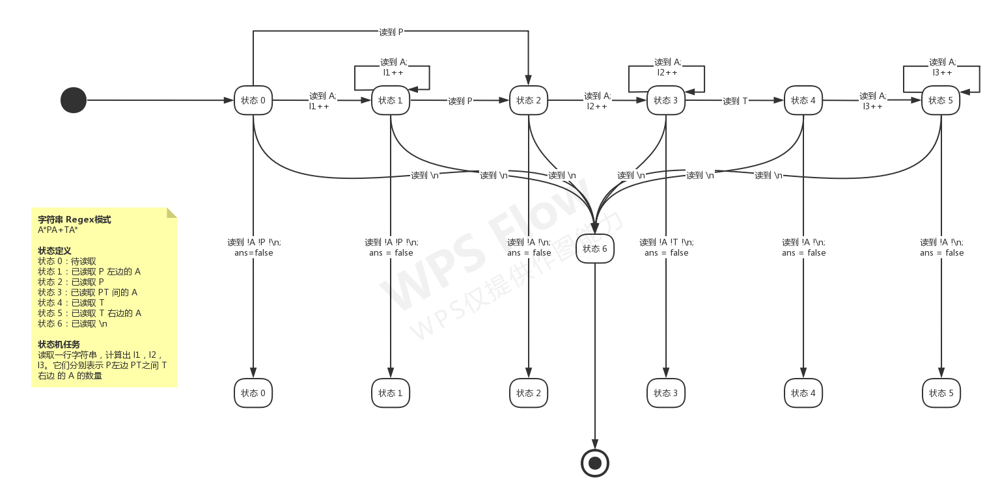

# 算法

* [排序 Sort](./sort.cpp)
  * 选择排序 Selection Sort
  * 插入排序 Insertion Sort
  * 归并排序 Merge Sort
* [全排列 Full Permutation](./full_permutation.cpp)
* [二分查找 Binary Search](./BinarySearch.cpp)
* [快速幂 Fast Power](./fastPower.cpp)
* [最大公约数和最小公倍数 Greatest Common Divisor & Least Common Multiple](./gcd_lcm.cpp)
* [素数 Prime Number](./prime.cpp)
  * sqrt 优化：素数判断
  * 埃氏（Eratosthenes）筛法：求素数表

# 数据结构

* [高精度整数 Big Integer](./data_structure/BigInteger.cpp)
* [分数 Fraction](./data_structure/Fraction.cpp)

# 小技巧

## 检索

- [取整与舍入 Round](#取整与舍入-round) 
- [有限状态机 Finite State Machine](#有限状态机-finite-state-machine) 

## 取整与舍入 Round

* 向下取整
  * C 函数：`Rounded_down(double x) = int(x)`
* 向上取整
  * 数学公式：$Ru(x) = \lfloor x \rfloor + 1 - \lfloor 1.0 \cdot \lfloor x + 1 \rfloor - x \rfloor$
  * C 函数：`Rounded_up(double x) = int(x) + 1 - int(1.0*int(x+1)-x)`
* 向上取整的整除
  * C 函数：`Rounded_up(int a, int b) = (a - 1) / b + 1;`
* 四舍五入
  * C 函数：`Round(double x) = int(x + 0.5)`
* 上下取整的关系
  * 数学公式：$\lceil x \rceil = \lfloor x \rfloor + \Delta,\quad \Delta = 1 - \lfloor 1.0 \cdot \lfloor x + 1 \rfloor - x \rfloor$

## 有限状态机 Finite State Machine

待补充
https://kdocs.cn/l/cobi7ul6fhWd
[金山文档] B1003 有限状态机.pom
